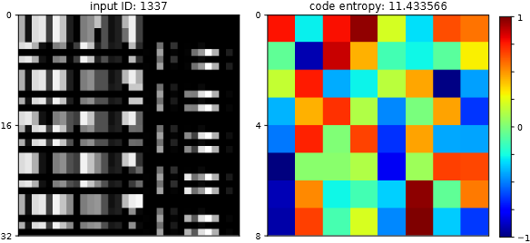

<pre>
  ______  ______  ______  ______     ______  ______ 
 /\  __ \/\  ___\/\  __ \/\  __ \   /\  __ \/\  ___\ 
 \ \  __/\ \ \___\ \  __ \ \  __/   \ \  __ \ \  _\_
  \ \_\   \ \_____\ \_\ \_\ \_\      \ \_\ \_\ \_____\ 
   \/_/    \/_____/\/_/\/_/\/_/       \/_/\/_/\/_____/
</pre>


__*Representation Learning for Content-Sensitive Anomaly Detection in Industrial Networks*__

Using a convGRU-based autoencoder, this thesis proposes a framework to learn spatial-temporal aspects of raw network traffic in an unsupervised and protocol-agnostic manner. The learned representations are used to measure the effect on the results of a subsequent anomaly detection and are compared to the application without the extracted features. The evaluation showed, that the anomaly detection could not effectively be enhanced when applied on compressed traffic fragments for the context of network intrusion detection. Yet, the trained autoencoder successfully generates a compressed representation (code) of the network traffic, which hold spatial and temporal information. Based on the models residual loss, the autoencoder is also capable of detecting anomalies by itself. Lastly, an approach for a kind of model interpretability (LRP) was investigated in order to identify relevant areas within the raw input data, which is used to enrich alerts generated by an anomaly detection method.

Master thesis submitted on 13.11.2021


---



---
* [__<em>Milestones</em>__](#milestones)
* [__<em>File Structure</em>__](#file-structure)
* [__<em>Install</em>__](#install)
	* [_tshark_](#tshark2620)
	* [_python_](#python373)
	* [_torch_](#torch171)
	* [_Verify Installation_](#verify-installation)
* [__<em>Usage</em>__](#usage)
    * [_Verify Framework_](#test-framework)
    * [_Jupyter Note Demo_](#jupyter-notebook-demo)
    * [_pcap2ds.py_](#pcap2dspy)
    * [_main.py_](#mainpy)
* [__<em>Hyperparameters</em>__](#hyperparameters)
* [__<em>Tested Hardware</em>__](#tested-hardware)
---

## *Milestones*
* **tex**
	* [x] finished paper
* **talk**
	* [x] initial presentation
	* [x] TUC presentation
	* [x] thesis defense
* **src**
	* [x] pcap -> dataset
	* [x] dataloader
	* [x] pytorch convGRU AE
	* [x] anomaly detection
	* [x] evaluation
	* [x] visualization
	* [x] demo notebooks
	* [x] experiment helper script
	* [x] LRP
* **experiments**
	* [x] baseline 
	* [x] SWAT
	* [x] VOERDE
---


## *File Structure*
<pre>
thesis
	├── <a href="src/">src</a>
	│   ├── <a href="src/lib/">lib</a>                          <ins><i>pcapAE Framework</i></ins>
	│   │   ├── <a href="src/lib/CLI.py">CLI.py</a><b>...................handle argument passing</b>
	│   │   ├── <a href="src/lib/H5Dataset.py">H5Dataset.py</a><b>.............data loading</b>
	│   │   ├── <a href="src/lib/ConvRNN.py">ConvRNN.py</a><b>...............convolutional recurrent cell implementation</b>
	│   │   ├── <a href="src/lib/decoder.py">decoder.py</a><b>...............decoder logic</b>
	│   │   ├── <a href="src/lib/encoder.py">encoder.py</a><b>...............encoder logic</b>
	│   │   ├── <a href="src/lib/model.py">model.py</a><b>.................network orchestration</b>
	│   │   ├── <a href="src/lib/pcapAE.py">pcapAE.py</a><b>................framework interface</b>
	│   │   ├── <a href="src/lib/earlystopping.py">earlystopping.py</a><b>.........training heuristic</b>
	│   │   └── <a href="src/lib/utils.py">utils.py</a><b>.................helper functions</b>
	│   └── <a href="requirements.txt">requirements.txt</a>
	│   │
	│   ├── <a href="src/ad/">ad</a>                           <ins><i>scikit-learn AD Framework</i></ins>
	│   │	├── <a href="src/ad/blueprints">AD model blueprints</a><b></b>
	│   │	├── <a href="src/ad/ad.py">AD.py</a><b>.. ..................AD wrappers</b>
	│   │	└── <a href="src/ad/utils.py">utils.py</a><b>..................helper functions</b>
	│   │
	│   ├── <a href="src/main.py">main.py</a><b>......................framework interaction</b>
	│   ├── <a href="src/pcap2ds.py">pcap2ds.py</a><b>...................convert packet captures to <i>datasets</i></b>
	│   └── <a href="src/test/test_install.py">test_install.py</a><b>..............rudimentary installation test</b>
	│
	├── <a href="exp/">exp</a>                              <ins><i>Experiments</i></ins>
	│   ├── <a href="exp/data.ods">data.ods</a><b>.....................results</b>
	│   ├── <a href="exp/dim_redu.py">dim_redu.py</a><b>..................experiment script</b>
	│   └── <a href="exp/exp_wrapper.sh">exp_wrapper.sh</a><b>...............execute experiments</b>
	│
	├── <a href="notebooks/">test</a>             	              <ins><i>Jupyter Notebooks</i></ins>
	│   ├── <a href="notebooks/demo.ipynb">demo.ipynb</a><b>...................Jupyter Notebook demo</b>
	│   ├── <a href="notebooks/visu_tool.ipynb">vius_tool.ipynb</a><b>..............PCAP analysis</b>
	│   └── <a href="notebooks/LRP.ipynb">LRP.ipynb</a><b>....................LRP Heatmap generation</b>
	│
	├── <a href="tex/">tex</a>                              <ins><i>Writing</i></ins>
	│	├── <a href="tex/main.pdf">thesis.pdf</a><b>....................paper</b>
	│	└── <a href="tex/papers.bib">papers.bib</a><b>....................sources</b>
	│
	├── <a href="LICENSE">LICENSE</a>
	└── <a href="README.md">README.md</a>

</pre>
---


## *Install*
- #### tshark>=2.6.20
```bash
apt-get install tshark capinfos
```

- #### 3.9>python>=3.7.3
```bash
apt-get install python3 pip3
pip install -r requirements.txt
```

- #### torch>=1.7.1
	GPU=>10.2
	```bash
	pip install torch torchvision
	```
	CPU ONLY
	```bash
	pip install torch==1.7.1+cpu torchvision==0.8.2+cpu torchaudio==0.7.2 -f https://download.pytorch.org/whl/torch_stable.html
	```

- #### *Verify Installation*
```bash
cd src/test/
./test_install.sh
```
---

## *Usage*

### [Test Framework](src/test/framework_test.sh)
```bash
./test_pcapAE.sh [--CUDA]
```

### [Jupyter Notebook Demo](notebooks/demo.ipynb)
---

### [__pcap2ds.py__](src/pcap2ds.py)

__[+] generate h5 data set from a set of PCAPs__


#### Arguments

|short|long|default|help|
| :---: | :---: | :---: | :---: |
|`-h`|`--help`||show this help message and exit|
|`-p`|`--pcap`|`None`|__path__ to pcap or list of pcap pathes to process|
|`-o`|`--out`|`None`|__path__ to output dir|
|`-m`|`--modus`|`None`|gradient decent __strategy__ | [byte | packet | flow]|
|`-g`|`--ground`|`None`|__path__ to optional evaluation packet level ground truth .csv|
|`-n`|`--name`|`None`|data set optional __name__|
|`-t`|`--threads`|`1`|__number__ of threads | __-1__ to use maximum|
||`--chunk`|`1024`|square number __fragment__ size|
||`--oneD`||process fragemnts in __one__ dimension|
||`--force`||__force__ to delete output dir path|

#### Usage
```bash
python3 pcap2ds.py -p <some.pcap> -o <out_dir> --chunk 1024 --modus byte [-g <ground_truth.csv>]
```
---

### [__main.py__](src/main.py)

__[+] pcapAE API wrapper__

train an autoencoder with a given h5 data set


#### Arguments

|short|long|default|help|options
| :---: | :---: | :---: | :---: | :---: |
|`-h`|`--help`||show this help message and exit||
|`-t`|`--train`||__path__ to dataset to learn||
|`-v`|`--vali`||__path__ to dataset to validate||
|`-f`|`--fit`||__path__ to data set to fit AD||
|`-p`|`--predict`||__path__ to data to make a predict on||
|`-m`|`--model`||__path__ to model to retrain or evaluate||
|`-b`|`--batch_size`|`128`|__number__ of samples per pass|[2,32,512,1024]|
|`-lr`|`--learn_rate`|`0.001`|starting learning __rate__ between | [1,0)
|`-fi`|`--finput`|`1`|__number__ input frames|[1,3,5]|
|`-o`|`--optim`|`adamW`|gradient decent __strategy__ | [adamW, adam, sgd]||
|`-c`|`--clipping`|`10.0`|gradient clip __value__ | [0,10]|
||`--fraction`|`1`|__fraction__ of data to process | (0, 1]|
|`-w`|`--workers`|`0`|__number__ of data loader worker threads | [0, 8]|
||`--loss`|`MSE`|loss __criterion__ | [MSE]|
||`--scheduler`|`cycle`|learn rate __scheduler__ | [step ; cycle ; plateau]|
||`--cell`|`GRU`|network cell __type__ | [GRU ; LSTM]|
||`--epochs`|`144`|__number__ of epochs|
||`--seed`|`1994`|__seed__ to fixing randomness||
||`--noTensorboard`||do not start tensorboard||
||`--cuda`||enable GPU support||
||`--verbose`||verbose output||
||`--cache`||cache dataset to GPU||
||`--retrain`||retrain given model||
||`--name`||experiment __name__ prefix||
||`--AD`||use AD framework||
||`--grid_search`||use AD gridsearch||

#### Usage
```bash
# pcapAE training
python3 main.py --train <TRAIN_SET_PATH> --vali <VALI_SET_PATH> [--cuda]

# pcapAE data compression (pcap -> _codes_)
python3 main.py --model <PCAPAE_MODEL> --fit <FIT_SET_PATH> --predict <PREDICT_SET_PATH> [--cuda]

# shallow ML anomaly detection training
python3 main.py --AD --model *.yaml --fit <REDU_FIT_SET_PATH> [--predict <REDU_PREDICT_SET_PATH>] [--grid_search]

# test training AD on new data
python3 main.py --model <AD_MODLE_PATH> --predict <REDU_SET_PATH>

# naive baseline
python3 main.py --baseline pcapAE --model <PCAPAE_MODEL> --predict <PREDICT_SET_PATH>

# raw baseline
python3 main.py --baseline noDL --AD --model ../test/blueprints/base_if.yaml --fit <FIT_SET_PATH> --vali <VALI_SET_PATH> --predict <PREDICT_SET_PATH> 

```
---


## *Hyperparameters*
* __Data__
	+ dataset = ```[VOERDE, SWaT] ```
	+ preprocessing = ```[byte, packet, flow] ```
	+ fragment size = ```[16**2, 32**2] ```
	+ sequence length = ```[1, 3 ,5] ```
* __Representation Learning__
	+ [optimizer](https://pytorch.org/docs/stable/optim.html) = ```[adamW, adam, SGD] ```
	+ [scheduler](https://pytorch.org/docs/stable/optim.html#torch.optim.lr_scheduler.OneCycleLR) = ```[step, cycle, plateau] ```
	+ [learn rate](https://miro.medium.com/max/2470/1*An4tZEyQAYgPAZl396JzWg.png) = ```[.1, .001] ```
	+ [cell](https://miro.medium.com/max/3032/1*yBXV9o5q7L_CvY7quJt3WQ.png) =  ```[GRU, LSTM] ```
	+ [loss function](https://en.wikipedia.org/wiki/Loss_function) = ```[MSE, BCE] ```
	+ [batch size](https://research.nvidia.com/sites/default/files/publications/adabatch_logo_medium.png) = ```[2, 512, 1024] ```
	+ [max epochs](https://miro.medium.com/max/700/1*GXftMdKjyaLYuAIn-nB4zA.png) = ```[144] ```
---


## *Tested Hardware*
* *Debian 10* | __Intel i5-6200U__ ~200 CUDA Cores
* *Ubuntu 18.04* | __AMD EPYC 7552__ ~1500 CUDA Cores
* *Cent OS 7.9* | __GTX 1080__ 2560 CUDA Cores
* *Ubuntu 20.04* | __RTX 3090__ 10496 CUDA Cores